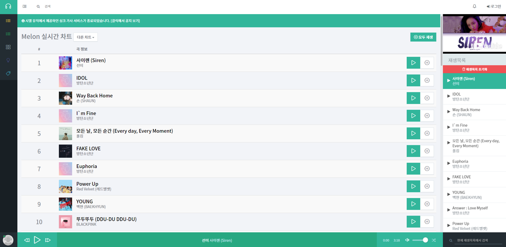
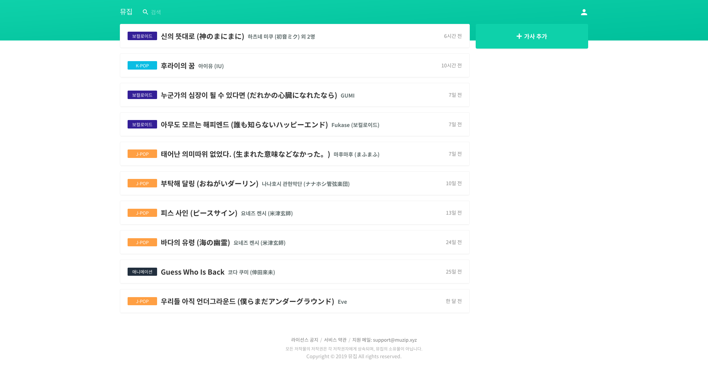
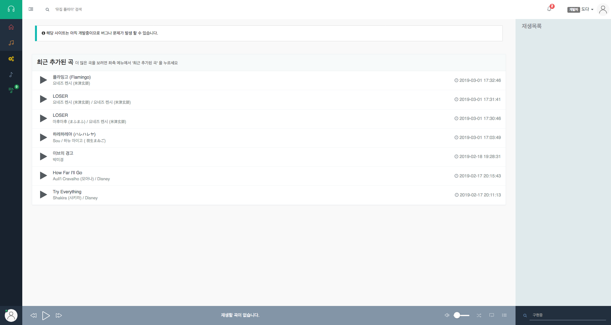
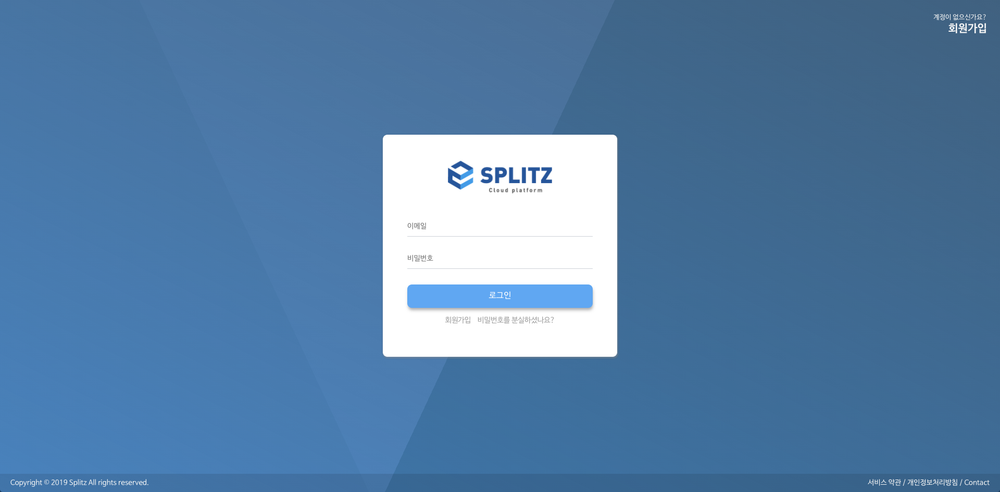
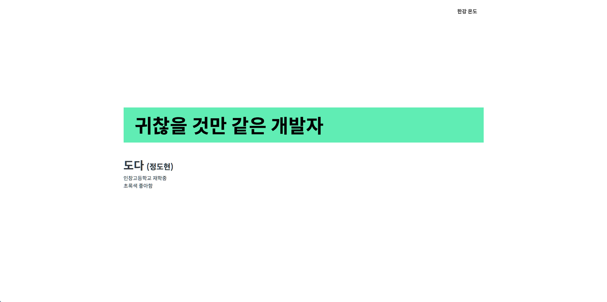
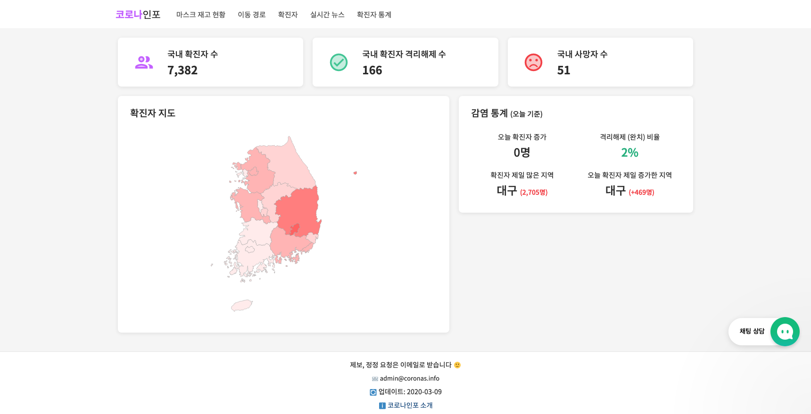

## My Projects 👨‍💻

- 실제로 서비스 된 경력이 있는 것만 나열하였습니다.
- 개발 순서대로 나열하였습니다.

🔼 **Ciel Music** (2017)

- **설명:** YouTube 영상 기반 음원 청취 사이트.
- **기술:** CodeIgniter + jQuery
- **형태:** 팀 프로젝트
- **담당:** JavaScript + UI 구현 담당 + 재생목록 구현

---

🔼 **뮤집** (2018~)

- **설명:** 음악 가사 및 정보 제공 사이트.
- **기술:** Laravel + Vue.js (Nuxt.js)
- **형태:** 개인 프로젝트

---

🔼 **뮤집 플레이** (2018)

- **설명:** YouTube 영상 기반 음원 청취 사이트. (Ciel Music 후속작)
- **기술:** CodeIgniter + jQuery + jquery-pjax
- **형태:** 개인 프로젝트

---

🔼 **Splitz Console** (2019)

- **설명:** 'Splitz' 서비스 관리 대시보드
- **기술:** Vue.js (Nuxt.js) + Laravel
- **형태:** 팀 프로젝트
- **담당:** 디자인, 프론트엔드, 백엔드 일부

---

🔼 **개인 홈페이지** (2019~)

- **설명:** 개인 포트폴리오 페이지.
- **기술:** React (Next.js)
- **형태:** 개인 프로젝트

---

🔼 **코로나인포** (2020)

- **설명:** 코로나-19 사태에 만들어진 사이트. 관련된 정보를 제공해줍니다.
- **기술:** React (Next.js)
- **형태:** 팀 프로젝트
- **담당:** 프론트엔드, 디자인
